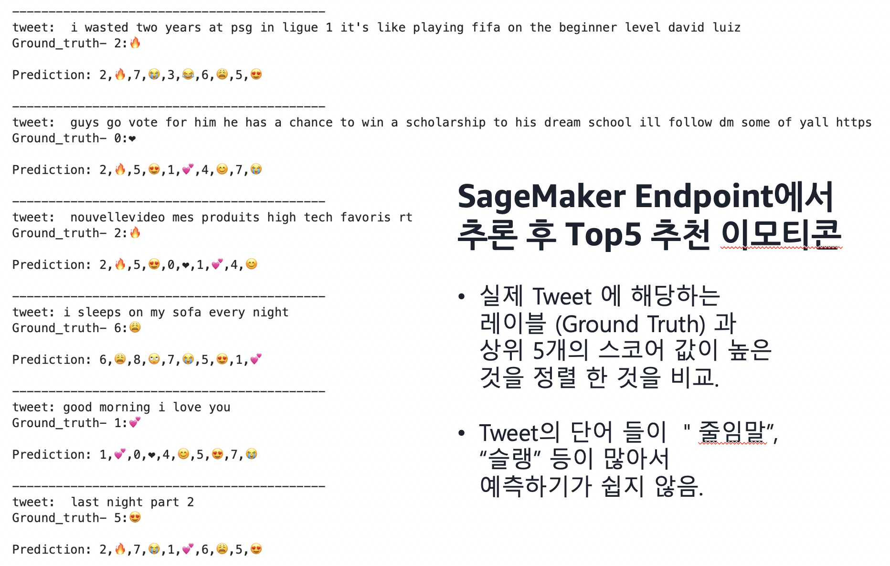

(2020.AWS DNA #1 교육 자료)

# Tweet의 감정상태에 따른 이모티콘 추천

## 솔류션 아키텍쳐

## 사용된 기술들 (Techniques)

## 모델 추천 결과

## 이 워크샵은 크게 세가지 과정으로 되어 있습니다.

- **기본 과정 (ML 파이프라인)**
    - "데이타 준비" --> "데이타 전처리" --> "모델 빌드" --> "모델 학습" --> "모델 배포 및 추론"
- OPTION 1
    - API GATEWAY 통해서 추론하기
- OPTION 2
    - Kubernetics/Kubeflow --> SageMaker Traing Job

- **Git의 많은 부분의 소스 코드는 아래 Git에서 가져왔습니다. 참고 하세요.**
    - Chris Fregly, Antje Barth, Book, Data Science on AWS, 
    - [Source: Data Science on Amazon Web Services](https://github.com/data-science-on-aws/workshop)

## 기본 과정 (ML 파이프라인)

### Prepare Tweet Data
- 1.1.Prepare-Tweet-Data.ipynb (1분 소요) 
    - Tweet 입력 데이터 클린징 및 S3에 업로드
    - [Module 1.0]
        - Option: [Module 1.5]- BERT Input 변환 과정 확인
        
### Preprocess Tweet Data
- OPTION
    - 2.0.Option-Scratch-Convert-Input-TFRecord.ipynb (소요시간 약 1분)
        - 이 노트북은 Text 입력 데이타가 최종적으로 사용할 TF Record 형태로 변환하는 과정을 보여줌
        - 만일 이 과정이 익숙하지 않다면 실행을 권고 함

- 2.1.Convert-Input-TFRecord.ipynb (6분 소요)  
    - Input Text --> BERT Feature Vector 로 변환 --> TF Record로 변환
    - SageMaker Processor Job으로 2개의 인스턴스를 사용하여 위 스크립트를 실행
    - Train, Validation, Test의 각각 2개의 TF Records 파일이 S3에 저장됨.

### Build a Train Script
- 3.1.Write-Train-Script.ipynb (1분 소요)
    - 학습에 사용할 스크립트를 작성 합니다.
- OPTION
    - 3.2.Train-LocalMode.ipynb
        - 작성한 학습 스크립트를 Local Mode를 사용하여 로직 테스트 합니다.

### Train a Model
학습은 아래 두가지 옵션이 있습니다. 
- BYOS (Bring Your Own Script)로서 보통 Script Mode 로 합니다. SageMaker의 Built-in Container (예: Tensorflow)에 학습 스크립트를 제공하고, 이후에 데이타를 입력(S3) 으로 제공하고, 출력으로서 모델 아티펙트를 S3에 저장 됩니다.
- BYOC (Bring Your Own Container)로서 실행환경의 Docker Image (학습 스크립트 + 환경:텐서플로우) 를 가져와서, 데이타를 입력(S3) 으로 제공하고, 출력으로서 모델 아티펙트를 S3에 저장 됩니다.

**위의 두 방식 중에 어느 한가지를 사용하여 학습을 하세요.**
- 선택 1: BYOS
    - 3.3.Train-BYOS-ScriptMode.ipynb     
        - 스크립트 모드로 학습 합니다.
- 선택 2: BYOC
    - 3.4.1.Make-Train-Image-ECR.ipynb
        - 로컬 노트북에서 Docker Image를 만들고, 이를 ECR(Elastic Container Registry)에 등록 합니다.
    - 3.4.2-Train-BYOC.ipynb    
        - ECR에 등록된 Docker Image를 가져와서 학습 합니다.
    
### Depoly a Model
배포를 하기 위해서는 기본적으로 세자기 항목이 필요 합니다.
- (1) 모델 아티펙트
    - 이 부분은 위의 학습의 산출물로서 S3에 저장이 되어 있습니다.
- (2) 추론 (Inference) image 
    - 위의 모델 아티펙트가 동작하기 위한 실행 환경을 제공 합니다. 예로 Tensorflow Serving 같은 것이 있습니다.
- (3) 추론 스크립트 (예: inference.py)
    - 모델 아티펙트에 "입력" 을 넣고, 이후에 모델 아티펙트를 통해서 "출력" 이 나오는데, "입력" 에 대한 사전처리와 "출력" 에 대한 사후 처리에 대한 스크립트 입니다.
    
이 과정에서는 두가지의 Inference Image 및 추론 스크립트 제공 방식을 사용 합니다.
- 방식 (1) 
    - Built-in Inference Image - Tensorflow Serving 2.0, 
    - 추론 스크립트 : Endpoint 기반에 tensorflow serving predictor를 생성하여 사용
- 방식 (2)
    - Custom Inference Image 생성
    - 추론 스크립트 : SageMaker Model를 생성시에 추론 스크립트 제공 (inference.py)

**위의 두 방식 중에 어느 한가지를 사용하여 배포를 하세요.**
- 선택 1: Built-in Inference Image
    - 4.1.Deploy-Built-In-TFS-Image.ipynb     
        - Tensorflow Serving 2.0 이미지를 가지고 배포 합니다.
- 선택 2: Custom Inference Image
    - 4.2.1.Make-Custom-Inference-Image-ECR.ipynb
        - 로컬 노트북에서 Docker Image를 만들고, 이를 ECR(Elastic Container Registry)에 등록 합니다.
    - 4.2.2.Deploy-Custom-Inference-Image.ipynb
        - ECR에 등록된 Docker Image를 가져와서 학습 합니다.

## OPTION 1: API GATEWAY 통해서 추론하기
기존에는 추론을 SageMaker Notebook에서 했습니다. 이번에는 API GATEWAY를 이용하여 외부 웹 페이지에서 HTTP POST Call 을 하여 추론 결과를 얻습니다. 아래 그림과 같이 구현 합니다.

아래 노트북의 가이드를 따라 하시면 됩니다.
- 4.3.API_GATEWAY.ipynb

## OPTION 2: Kubernetics/Kubeflow --> SageMaker Traing Job

Kubernetics/Kubeflow 에서 SageMaker Cloud Cluster로 학습을 요청하여, 학습의 결과인 모델 아티펙트를 가지고 SageMaker Cloud Cluster에서 추론을 하는 과정 입니다.
자세한 가이드는 
**[관련 가이드](Tweet-BERT/install_EKS_Kubeflow/README.md)** 참조 하세요.

---
## Reference
- Chris Fregly, Antje Barth, Book, Data Science on AWS, https://www.oreilly.com/library/view/data-science-on/9781492079385/
    - Source: Data Science on Amazon Web Services
        - https://github.com/data-science-on-aws/workshop

- Original Data Source
    - Douwe Osinga, Deep Learning Cookbook. Ch7, Suggesting Emojis
https://www.amazon.com/Deep-Learning-Cookbook-Practical-Recipes/dp/149199584X

- Huggingface Transformers  
https://github.com/huggingface/transformers

- Kubernetes and Amazon SageMaker for machine learning — best of both worlds
https://towardsdatascience.com/kubernetes-and-amazon-sagemaker-for-machine-learning-best-of-both-worlds-part-1-37580689a92f
        
