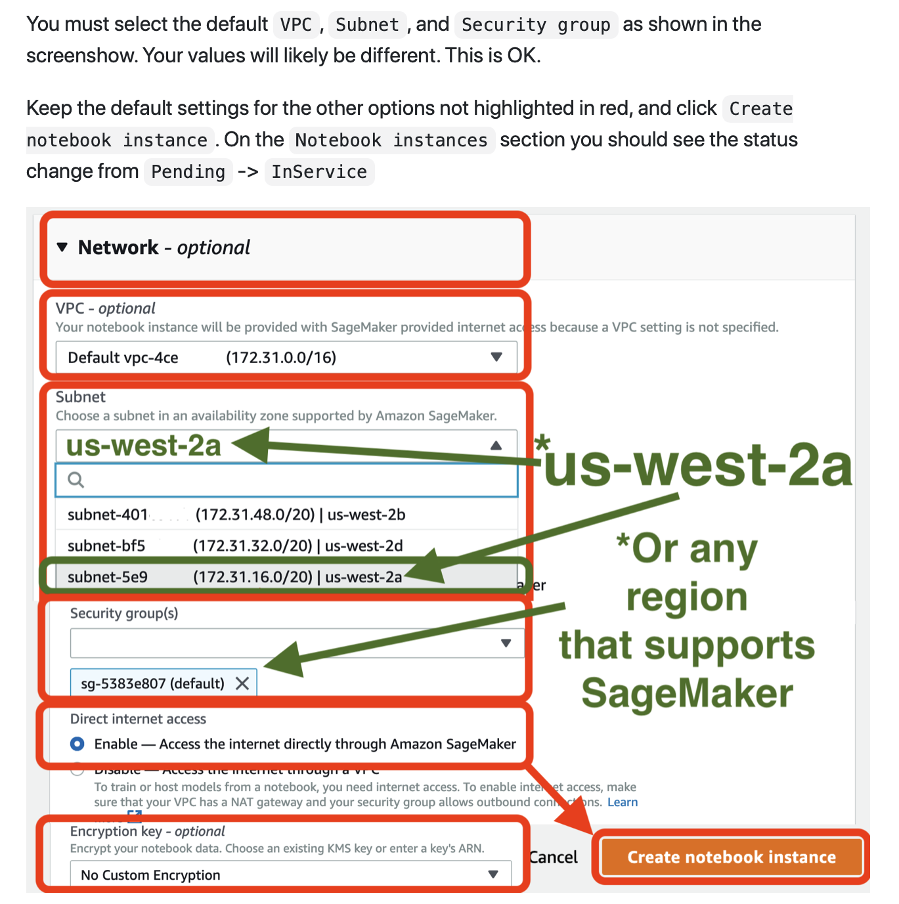
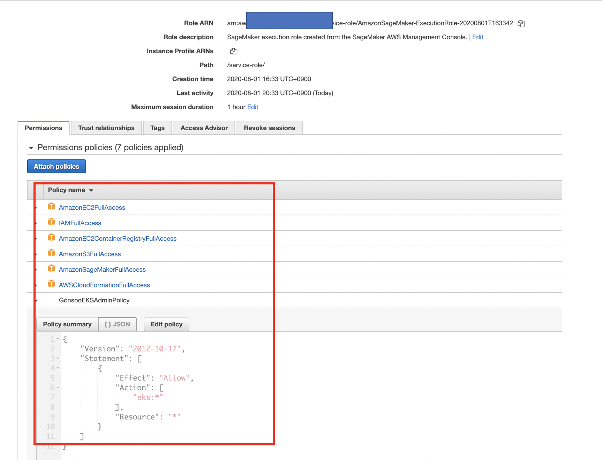
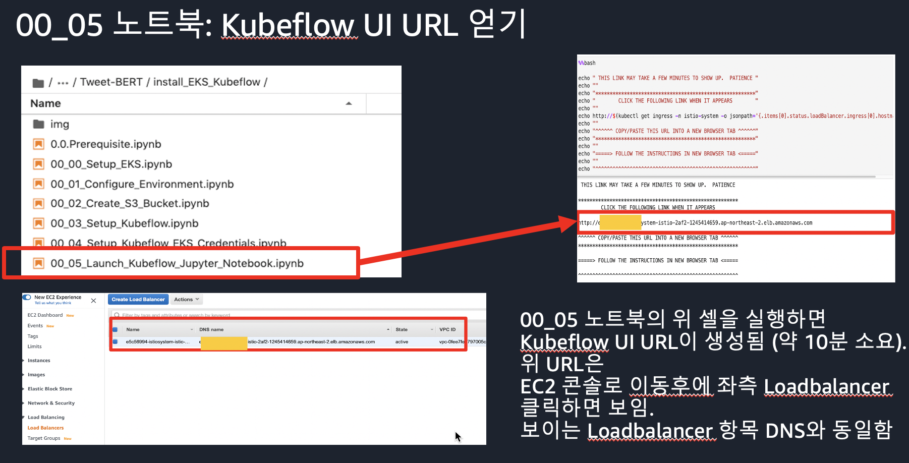
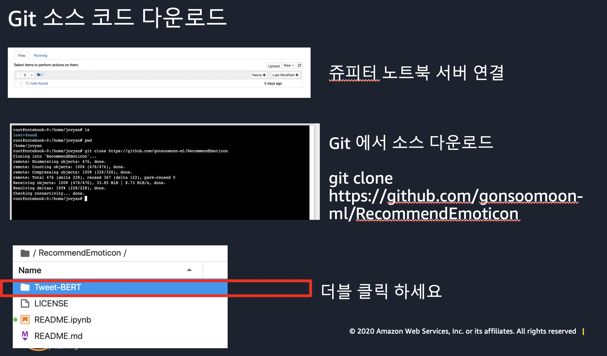
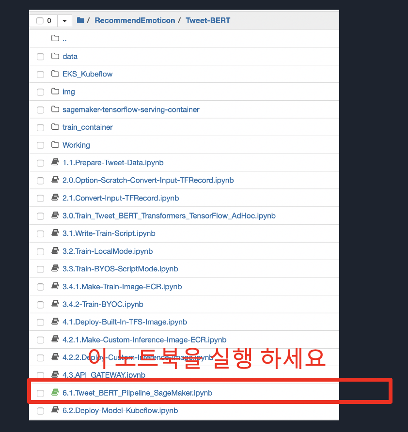
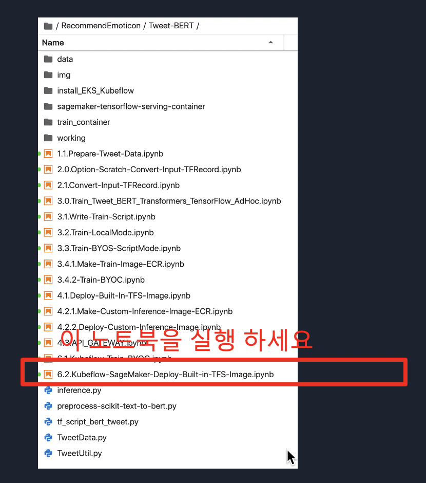

# Kubeflow Pipeline에서 SageMaker Components 사용하기 


## (1) SageMkaer Notebook 생성 

참고: 0.0.Prerequisite 노트북과 동일


**현재 이 노트북을 열고 있는 SageMaker가 아래 처럼 네트워크와 보안 그룹이 설정이 안되어 있다고 하면
SageMaker 노트북을 아래와 같이 설정하여 노트북 인스턴스를 하나 더 생성 하세요.**

**SageMaker Notebook을 생성할시에 아래와 같이 네트워크 및 보안 그룹 설정이 꼭 필요합니다.**



아래는 "Data Science on AWS" 워크샵의 Git 리파지토리 입니다. 
여기서는 세이지 메이커 노트북 생성 부분만 참고 하시면 됩니다.<br>
여기 --> [Data Science on AWS](https://github.com/data-science-on-aws/workshop)


## (2) SageMkaer Notebook 생성한 Role에 권한 할당 

참고: 0.0.Prerequisite 노트북과 동일

아래와 같이 권한을 추가 해주세요. 만일 Admin 혹은 Teamrole 같은 관리자 권한이라고 하면 아래 과정을 스킵 하셔도 됩니다.


## (3) EKS (Elastic Kubernetics Service) 및 Kubeflow 설치

아래와 같이 노트북 00_00 ~ 00_05 까지 실행 해주세요

        
        
## (4) Kubeflow Dashboard 접근 및 Kubeflow 노트북 서버 설치

'00_05_Launch_Kubeflow_Jupyter_Notebook.ipynb' 노트북안의 셀 중에 Kubeflow Dashboard에 접근할 수 있는 URL을 얻습니다. 이후는 노트북의 가이드를 따라 가주세요.



## (5) Kubeflow 노트북 서버에서 Git 리파지토리 다운로드

이후에 아래의 리파지토리를 다운로드 받아 사용하세요**
```
git clone https://github.com/gonsoomoon-ml/RecommendEmoticon
```



## (6) Kubeflow 노트북 서버에서 Git 리파티지토의의 노트북 실행


## (7) SageMaker Notebook에서 노트북 실행

